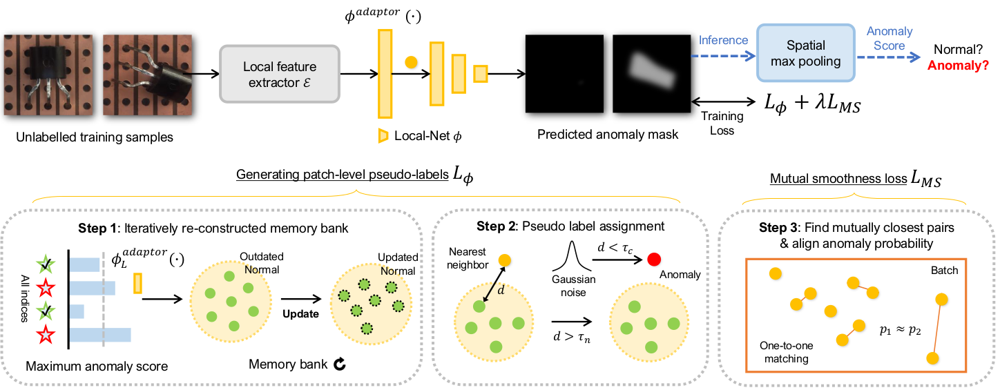

# FUN-AD: Fully Unsupervised Learning for Anomaly Detection with Noisy Traning Data

Official Pytorch implementation of [FUN-AD: Fully Unsupervised Learning for Anomaly Detection with Noisy Traning Data] [WACV 2025].

Authors: Jiin Im, Yongho Son, Je Hyeong Hong

## Abstract
While the mainstream research in anomaly detection
has mainly followed the paradigm of one-class classification,
practical industrial environments often incur noisy training data
due to annotation errors or absence of labels as the result
of insufficient annotations for new or refurbished products.
To address these issues, we present a novel learning-based
approach for the challenging task of fully unsupervised anomaly
detection whereby the training data is unlabeled and potentially
contaminated with anomalies. Our method is motivated by two
observations, that i) the pairwise feature distances between the
normal samples are on average likely to be smaller than those
between the anomaly samples or heterogeneous samples and ii)
pairs of features mutually closest to each other are likely to be
homogeneous pairs, which hold if the normal data has smaller
variance than the anomaly data. Since the first observation
implies that the nearest neighbor distances of individual training
samples can provide a cue for distinguishing confident normal
samples and anomalies in the absence of labels, we subsequently
use this finding to propose a new pseudo-labeling strategy
based on iteratively re-constructed memory bank (IRMB) with
the aim of generating a feasible gradually-sharpened learning
signal for fully unsupervised anomaly detection. The second
observation is utilized as a new loss function to promote class-
homogeneity between mutually closest pairs thereby reducing
the ill-posedness of the task. Experimental results on two public
industrial anomaly benchmarks and semantic anomaly examples
validate the effectiveness of FUN-AD across different scenarios
and anomaly-to-normal ratios.



## Contribution
- a new pseudo-labeling approach based on iteratively re-constructed memory bank~(IRMB) designed to utilize above statistics of pairwise distances and maintain robustness to noisy training data

- a novel mutual smoothness loss (inspired by the local smoothness assumption in unsupervised learning) which reduces the ill-posedness of the task by aligning anomaly scores of mutually closest feature pairs under the validated assumption that they largely belong to the same class

- a simple yet effective iterative learning-based framework for fully unsupervised anomaly detection incorporating our pseudo-labeling approach coupled with the mutual smoothness loss, achieving mostly state-of-the-art anomaly detection and localization performances under different contaminated settings of two public industrial anomaly datasets (MVTec AD and VisA).

## Data preparation:
Download the following datasets:
- MVTec-AD [[Official]](https://www.mvtec.com/company/research/datasets/mvtec-ad/)
- VisA [[Official]](https://github.com/amazon-science/spot-diff)
- Synthetic dataset (MVTec-AD) [[Our Link]](https://drive.google.com/file/d/1isdwowvxEOkGkQkz4ewVJZXZwPz6jNvA/view?usp=sharing)
- DINO feature (MVTec-AD) [[Our Link]](https://drive.google.com/file/d/12WaHebolz6Z2AqXXOIjVxVx94eij3MLF/view?usp=sharing)

## Prerequisites:
````
conda create -n funad python=3.9 -y
conda activate funad

conda install pytorch==2.0.1 torchvision==0.15.2 torchaudio==2.0.2 pytorch-cuda=11.8 -c pytorch -c nvidia
conda install pytorch::faiss-gpu

git clone https://github.com/HY-Vision-Lab/FUNAD.git
cd FUNAD
pip install -r requirements.txt
````


## 🏃 How to run our code!
To train FUN-AD on [MVTec AD](https://www.mvtec.com/company/research/datasets/mvtec-ad) with 0.1 additional noise samples, run

````
# without synthetic data
python self_train_ad.py -b 32 --k_number 2 --epoch 1500 --balancing --gaussian --kl --weight 2.5 --oto_loss mae --dataset mvtec -d bottle --noise 10%

# with additional 5% synthetic data
python self_train_ad.py -b 32 --k_number 2 --epoch 1500 --balancing --gaussian --kl --weight 2.5 --oto_loss mae --dataset mvtec -d bottle --noise 10% --perlin --perin_ratio 5%
````


## Citation
````

````
## License
A patent application for FUN-AD has been submitted and is under review for registration. FUN-AD is licensed under the CC-BY-NC-SA-4.0 license limiting any commercial use.
